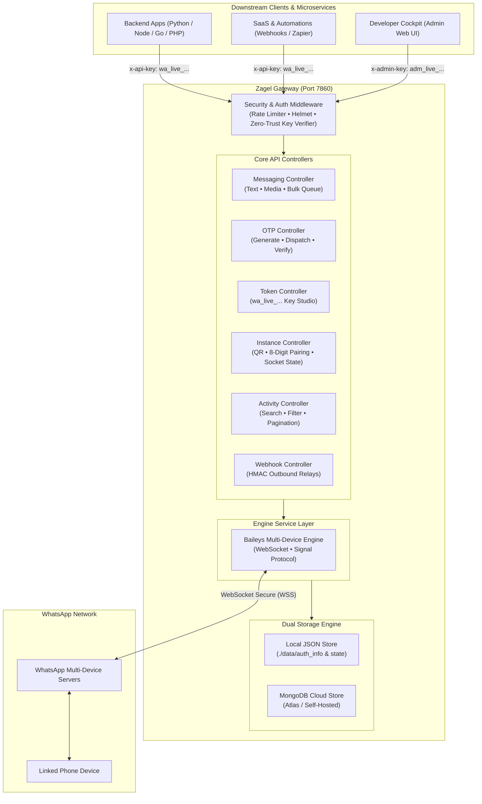

<div align="center">


# Zagel (زاجل)

### Production-Grade WhatsApp REST API Gateway & Developer Cockpit

[](LICENSE)
[](https://nodejs.org/)
[](https://github.com/WhiskeySockets/Baileys)
[](Dockerfile)
[](https://www.mongodb.com/)

<p align="center">
  <b>Fast, autonomous, single-container REST API microservice and developer command center.</b><br/>
  Automate WhatsApp notifications, OTP authentication, media dispatch, and bidirectional webhooks from Python, Node.js, Go, PHP, or cURL without heavy multi-container Docker Compose stacks or vendor lock-in.
</p>

---

[Key Capabilities](#-key-capabilities) •
[Architecture](#-architecture--core-design) •
[Developer Cockpit](#-developer-cockpit) •
[Quick Start](#-quick-start) •
[API Reference](#-api-reference) •
[Deployment](#-deployment-guides) •
[Security](#-authentication--security)

</div>

---

## 📖 The Story Behind Zagel (زاجل)

Throughout history across the Middle East and Mediterranean, **Hammam Al-Zagel (حمام زاجل — Carrier Pigeon)** served as the premier, fault-tolerant network for mission-critical instant communication. Long before cables and satellite signals, pigeons delivered vital messages across thousands of kilometers with unmatched speed, autonomy, and resilience.

**Zagel (زاجل)** modernizes this heritage into software: a lightweight, production-grade WhatsApp microservice that carries notifications, security OTP codes, and rich media straight from your servers to end-user devices with zero operational overhead.

---

## ⚡ Key Capabilities

- **🚀 Single-Container Architecture**: Self-contained with local atomic JSON storage or cloud MongoDB. Runs as a standalone Node.js process or single Docker container with **zero external database dependencies** (no mandatory PostgreSQL, no Redis, no Docker Compose).
- **💾 Flexible Dual Storage Engine (Local Files or MongoDB)**:
  - **Local Mode (Default)**: Persists WhatsApp session ratchets, API tokens, activity feeds, and settings atomically in `./data` JSON files.
  - **MongoDB Cloud Mode**: Setting `MONGODB_URI` connects to MongoDB (Atlas or self-hosted) and automatically migrates existing local data on first boot. Ideal for ephemeral container platforms (Render, Railway, Fly.io, Cloud Run).
- **🖥️ Developer Cockpit**: High-density developer dashboard served directly at `http://localhost:7860/` featuring an upper operational deck, an interactive testing studio with live response & code generation, and a dedicated full-width paginated audit feed.
- **📱 Dual WhatsApp Pairing Modes**: Connect via high-contrast QR code scan or 8-digit phone pairing passcode (no camera scan required).
- **🔑 Cryptographic API Key Governance**: Issue and revoke `wa_live_...` client keys with timing-safe SHA-256 validation. Strict zero-trust separation between Admin and downstream API roles.
- **💬 Rich Dispatch Suite**: Send plain text, bulk queues with anti-spam jitter delays, and rich media (images, PDFs, documents, voice notes, video) via URL or Base64 with built-in SSRF protection.
- **🔐 One-Time Password (OTP) Engine**: Built-in 6-digit OTP delivery and verification with automated expiration windows and anti-bombing cooldowns.
- **📊 Real-Time Observability Deck**: Complete activity feed with server-side pagination, search filtering, type/status filters, and live auto-polling.
- **🪝 Outbound Webhooks**: Deliver incoming messages and delivery receipts to external endpoints with HMAC-SHA256 signature verification.

---

## 🏛️ Architecture & Core Design

Zagel bridges external applications with the WhatsApp Multi-Device network through a clean, layered architecture:



---

## 🖥️ Developer Cockpit

The gateway serves a built-in web cockpit directly at root **`http://localhost:7860/`** (also accessible via `/dashboard`, `/cockpit`, or `/app`).

```
+--------------------------------------------------------------------------------------------------+
|  🕊️ Zagel v2.0 Production    [Engine: Baileys]  [Uptime: 4h 12m]  [● WhatsApp Connected]         |
|                              [API Tokens: 3]    [Live Feed: ●]   [🔒 Admin Session]             |
+--------------------------------------------------------------------------------------------------+
|  OPERATIONAL DECK (Left: 1fr)                    |  TESTING STUDIO & CODE GENERATOR (Right: 1.15fr)  |
|  • WhatsApp Socket Link (Status, JID, Unlink)    |  • Test Text / Media / OTP Dispatches           |
|  • Dual Pairing: QR Code & 8-Digit Phone Passcode|  • Live Console: Latency (ms) + Status + JSON   |
|  • API Token Studio (Generate & Revoke Keys)     |  • Dynamic Snippets: cURL, Python, Node, Go     |
+--------------------------------------------------------------------------------------------------+
|  OBSERVABILITY DECK (Full-Width Stream)                                                          |
|  • Live Dispatch Feed with Debounced Search, Type/Status Filtering, and Server-Side Pagination    |
|  • One-Click Record Deletion & Clear Feed with Inline Confirmation Drawers                       |
+--------------------------------------------------------------------------------------------------+
```

### Upper Operational Deck (Two-Column Balanced Grid)
- **WhatsApp Device Link**: Monitor real-time WebSocket connection state, instance JID, session storage mode, and watchdog health. Unlink devices with inline confirmation drawers (no disruptive browser alerts).
- **API Token Studio**: Generate cryptographically secure `wa_live_...` keys, view masked credentials, copy tokens in one click, and revoke tokens with per-row confirmation.
- **Interactive Testing Studio**:
  - Test Text, Media, and OTP dispatches interactively.
  - **Unified Console Panel**: Toggle between **API Response** (displaying real-time HTTP status, round-trip latency in `ms`, and formatted JSON) and **Integration Code** (live snippets in cURL, Python, Node.js, and Go).

### Lower Observability Deck (Dedicated Full-Width Feed)
- **Live Dispatch & Audit Feed**:
  - **Live Search**: Instant debounced searching by recipient number, preview text, error trace, or message ID.
  - **Filter Controls**: Filter by Type (`TEXT`, `MEDIA`, `OTP_SEND`, `OTP_VERIFY`) and Status (`SENT`, `VERIFIED`, `FAILED`).
  - **Pagination Engine**: Controls for page navigation (`First`, `Prev`, dynamic page numbers, `Next`, `Last`) and configurable page sizes (`10`, `25`, `50` per page).
  - **Live Stream Toggle**: Pulsing live polling indicator with one-click pause and resume.
  - **Record Deletion**: Delete individual audit entries or clear the entire feed using inline confirmations.

---

## 🏁 Quick Start

### 1. Install & Launch (Local Machine)

```bash
# Clone the repository
git clone https://github.com/Abdelrahman0xFF/zagel.git
cd zagel

# Install dependencies
npm install

# Start the gateway (listens on default port 7860)
npm start

# Or run with auto-reload during development
npm run dev
```

### 2. Connect WhatsApp via Developer Cockpit

1. Open **`http://localhost:7860/`** (or `http://localhost:7860/dashboard`) in your browser.
2. Unlock the Developer Cockpit with your Master Admin Key (`ADMIN_API_KEY`).
   > *If `ADMIN_API_KEY` was left blank in `.env`, a secure key is auto-generated and printed to your terminal on startup.*
3. Choose your pairing method:
   - **QR Code Scan**: Scan the QR code in WhatsApp (**Settings** &rarr; **Linked Devices** &rarr; **Link a Device**).
   - **8-Digit Phone Pairing Code**: Click _"Phone Pairing Code"_, enter your phone number with international country code, and type the 8-character passcode into WhatsApp.

### 3. Generate a Client Token & Dispatch Your First Message

1. In the **API Tokens** section of the cockpit, click **"Generate Key"** (e.g. label `backend-service`).
2. Copy your new `wa_live_...` bearer token.
3. Send a test message via cURL:

```bash
curl -X POST "http://localhost:7860/api/messages/send" \
  -H "Content-Type: application/json" \
  -H "x-api-key: YOUR_WA_LIVE_TOKEN" \
  -d '{
    "number": "201012345678",
    "message": "Hello from Zagel! 🕊️"
  }'
```

---

## 🔐 Authentication & Security

Zagel implements a strict **Dual-Tier Role-Based Security Architecture**:

```
                             [ INCOMING HTTP REQUEST ]
                                         │
                                         ▼
                     ┌───────────────────────────────────────┐
                     │ Query Parameter Check (?api_key=...)   │
                     │ Rejected with 401 Unauthorized         │
                     └───────────────────┬───────────────────┘
                                         │ Passed via HTTP Header
                                         ▼
                     ┌───────────────────────────────────────┐
                     │          Header Evaluator             │
                     └───────┬───────────────────────┬───────┘
                             │                       │
               x-admin-key / Bearer (adm_live_)      │ x-api-key / Bearer (wa_live_)
                             │                       │
                             ▼                       ▼
            ┌────────────────────────────────┐   ┌────────────────────────────────┐
            │       MASTER ADMIN ROLE        │   │        CLIENT API ROLE         │
            │ • Developer Cockpit Web UI     │   │ • Text Messages Dispatches     │
            │ • Token Lifecycle (Gen/Revoke) │   │ • Media & Document Dispatches  │
            │ • Device Pairing (QR / 8-digit)│   │ • Bulk Queue Dispatches        │
            │ • Activity Audit Feeds & Delete│   │ • OTP Passcode Send & Verify   │
            │ • Outbound Webhook Config      │   │                                │
            │ • Full System Diagnostics      │   │ ❌ Blocked from Admin Tools    │
            └────────────────────────────────┘   └────────────────────────────────┘
```

> [!IMPORTANT]
> **Strict Header-Only Authentication**: For production security, passing tokens via URL query parameters (`?api_key=...` or `?admin_key=...`) is strictly rejected with `401 Unauthorized` to prevent credentials from leaking into reverse proxy logs, browser histories, and HTTP Referer headers.

---

## 📡 API Reference

Base URL: `http://localhost:7860` (or your deployed host)

### 1. Messaging Endpoints

#### Send Text Message
`POST /api/messages/send` *(Alias: `POST /api/send-message`)*  
**Auth**: `x-api-key: wa_live_...`

```json
{
  "number": "201012345678",
  "message": "Your verification code is 492019."
}
```
*Note: Accepts `number`, `phone`, `to`, or `phoneNumber` with international country code digits.*

**Response (`200 OK`):**
```json
{
  "success": true,
  "message": "WhatsApp message sent successfully.",
  "data": {
    "recipient": "201012345678",
    "messageId": "3EB09F2A9318",
    "status": "SENT",
    "timestamp": "2026-09-19T10:30:00.000Z"
  }
}
```

#### Send Media & Documents
`POST /api/messages/send-media`  
**Auth**: `x-api-key: wa_live_...`  
Supports `image`, `document`, `audio`, and `video` attachments via remote URL or Base64 string with streaming SSRF safeguards.

```json
{
  "number": "201012345678",
  "type": "document",
  "mediaUrl": "https://example.com/invoices/inv_1092.pdf",
  "fileName": "Invoice_1092.pdf",
  "caption": "Monthly statement attached."
}
```

#### Bulk Messages
`POST /api/messages/send-bulk`  
**Auth**: `x-api-key: wa_live_...`  
Dispatches sequentially or in the background with anti-spam jitter delays.

```json
{
  "messages": [
    { "number": "201012345678", "message": "Notice for Customer A" },
    { "number": "15551234567", "message": "Notice for Customer B" }
  ],
  "async": true,
  "delayMs": 1500
}
```

**Response (`202 Accepted` when `async: true`):**
```json
{
  "success": true,
  "status": "QUEUED",
  "message": "Bulk dispatch accepted and processing asynchronously in background.",
  "batchId": "batch_9f1a2b3c4d5e",
  "total": 2
}
```

---

### 2. Token Governance Endpoints

| Method | Endpoint | Auth | Description |
| :--- | :--- | :--- | :--- |
| `POST` | `/api/tokens/generate` | Master Admin | Generate a new cryptographically secure bearer token (`{"name": "CRM"}`) |
| `GET` | `/api/tokens` | Master Admin | List all active tokens with masked keys and creation timestamps |
| `DELETE` | `/api/tokens/:id` | Master Admin | Immediately revoke and invalidate an API token |

---

### 3. Activity & Audit Feed Endpoints

#### Get Paginated Activity Logs
`GET /api/activity`  
**Auth**: Master Admin

| Parameter | Type | Default | Description |
| :--- | :--- | :--- | :--- |
| `page` | `number` | `1` | Page number to retrieve (1-indexed) |
| `limit` | `number` | `10` | Records per page (min 1, max 100) |
| `type` | `string` | `ALL` | Filter: `ALL`, `TEXT`, `MEDIA`, `OTP_SEND`, `OTP_VERIFY` |
| `status` | `string` | `ALL` | Filter: `ALL`, `SENT`, `FAILED`, `VERIFIED` |
| `search` | `string` | `""` | Search query across recipient phone, preview, error, or message ID |

#### Delete Single Activity Record
`DELETE /api/activity/:id`  
**Auth**: Master Admin — Deletes a specific audit record by its ID.

#### Clear Activity Feed
`DELETE /api/activity/clear`  
**Auth**: Master Admin — Permanently clears all activity records.

---

### 4. OTP Verification Endpoints

#### Request OTP Passcode
`POST /api/otp/send`  
**Auth**: `x-api-key: wa_live_...`

```json
{
  "number": "201012345678",
  "appName": "Secure Portal",
  "length": 6,
  "expiresInMinutes": 5
}
```

#### Verify OTP Passcode
`POST /api/otp/verify`  
**Auth**: `x-api-key: wa_live_...`

```json
{
  "number": "201012345678",
  "code": "839201"
}
```

**Response (`200 OK`):**
```json
{
  "success": true,
  "status": "VERIFIED",
  "message": "Phone number verified successfully!"
}
```

---

### 5. WhatsApp Instance & Device Linking

| Method | Endpoint | Auth | Description |
| :--- | :--- | :--- | :--- |
| `GET` | `/api/instance/status` | Public / Admin | Get connection state (`open`, `connecting`, `disconnected`) |
| `GET` | `/api/instance/qr` | Master Admin | Get current pairing QR code as base64 Data URL |
| `POST` | `/api/instance/pairing-code` | Master Admin | Generate 8-digit phone pairing passcode (`{"number": "2010..."}`) |
| `POST` | `/api/instance/connect` | Master Admin | Force socket reconnect |
| `POST` | `/api/instance/restart` | Master Admin | Restart internal Baileys client |
| `POST` | `/api/instance/logout` | Master Admin | Unlink device and reset session credentials |

---

### 6. Webhooks & System Diagnostics

| Method | Endpoint | Auth | Description |
| :--- | :--- | :--- | :--- |
| `GET` | `/api/health` | Public | Liveness check, engine mode, socket state, and uptime (sanitized) |
| `GET` | `/api/admin/status` | Master Admin | Returns session status, whitelist phone, and storage topology |
| `POST` | `/api/admin/verify` | Public (Rate-limited) | Verify Master Admin Key to unlock Cockpit |
| `GET` | `/api/webhooks/status` | Master Admin | Check webhook URL and delivery metrics |
| `POST` | `/api/webhooks/configure` | Master Admin | Configure external webhook URL (`{"url": "https://..."}`) |
| `POST` | `/api/webhooks/test` | Master Admin | Dispatch synthetic ping payload to test connectivity |

---

## 💻 Integration Code Samples

### Python (`requests`)

```python
import requests

GATEWAY_URL = "http://localhost:7860"
API_KEY = "wa_live_YOUR_TOKEN_HERE"

def send_whatsapp(recipient: str, message: str):
    url = f"{GATEWAY_URL}/api/messages/send"
    headers = {
        "Content-Type": "application/json",
        "x-api-key": API_KEY
    }
    payload = {
        "number": recipient,
        "message": message
    }
    response = requests.post(url, json=payload, headers=headers)
    return response.json()

# Dispatch example:
print(send_whatsapp("201012345678", "Hello from Python! 🕊️"))
```

### Node.js / TypeScript (`fetch`)

```typescript
const GATEWAY_URL = "http://localhost:7860";
const API_KEY = "wa_live_YOUR_TOKEN_HERE";

async function sendWhatsApp(number: string, message: string) {
  const response = await fetch(`${GATEWAY_URL}/api/messages/send`, {
    method: "POST",
    headers: {
      "Content-Type": "application/json",
      "x-api-key": API_KEY,
    },
    body: JSON.stringify({ number, message }),
  });

  return await response.json();
}

sendWhatsApp("201012345678", "Hello from Node.js! 🕊️").then(console.log);
```

### cURL

```bash
curl -X POST "http://localhost:7860/api/messages/send" \
  -H "Content-Type: application/json" \
  -H "x-api-key: wa_live_YOUR_TOKEN_HERE" \
  -d '{
    "number": "201012345678",
    "message": "Hello from cURL! 🕊️"
  }'
```

---

## ☁️ Deployment Guides

### Option A: Standalone Docker Container (`docker run`)

Run an isolated container on any server, home lab, or virtual machine with persistent data volume:

```bash
# Build the production Docker image
docker build -t zagel .

# Run container with persistent data volume and restart policy
docker run -d \
  --name zagel \
  --restart unless-stopped \
  -p 7860:7860 \
  -v $(pwd)/data:/app/data \
  --env-file .env \
  zagel
```
*(On Windows PowerShell, replace `$(pwd)` with `${PWD}`)*

---

### Option B: Virtual Private Server (Linux VPS / PM2)

For native Node.js hosting on any Linux VPS (Ubuntu, Debian, AlmaLinux, Rocky):

```bash
# 1. Clone repository onto VPS
git clone https://github.com/Abdelrahman0xFF/zagel.git
cd zagel && npm install

# 2. Configure environment
cp .env.example .env
nano .env # Set your ADMIN_API_KEY and PORT

# 3. Start with PM2 process manager for 24/7 background persistence
npm install -g pm2
pm2 start src/server.js --name zagel --max-memory-restart 500M
pm2 startup && pm2 save
```

---

### Option C: Managed Cloud Container Platforms (Render, Railway, Fly.io)

Deploy to any cloud container platform using Git integration:

1. Push your repository to GitHub / GitLab.
2. Create a new **Web Service** or **Container App** in your cloud platform dashboard.
3. Select **Docker** deployment mode (it automatically detects [`Dockerfile`](Dockerfile) and exposes port `7860`).
4. Set your environment variables:
   - `ADMIN_API_KEY=your_secure_master_key`
   - `PORT=7860`
   - `MONGODB_URI=mongodb+srv://...` *(Recommended for cloud: persists sessions, keys, and logs across container restarts without attaching disk volumes)*
5. Open your deployed service URL at `/` or `/dashboard`, unlock with your `ADMIN_API_KEY`, and link your WhatsApp device.

---

## ⚙️ Environment Variables

| Variable | Default | Description |
| :--- | :--- | :--- |
| `PORT` | `7860` | HTTP server listening port |
| `HOST` | `0.0.0.0` | Bind host address |
| `NODE_ENV` | `development` | Runtime environment (`development`, `production`, `test`) |
| `WHATSAPP_ENGINE` | `baileys` | Engine mode: `baileys` (embedded) or `evolution` (remote) |
| `MONGODB_URI` | *(empty)* | MongoDB connection URI. If provided, enables MongoDB storage mode. If blank, defaults to local `./data` JSON files |
| `MONGODB_DB_NAME` | `whatsapp_gateway` | Database name to use in MongoDB |
| `SESSION_DATA_PATH` | `./data/auth_info` | Local directory for WhatsApp multi-device session credentials |
| `ADMIN_API_KEY` | *(auto-generated)* | Master Admin Key for Web Cockpit, key management, QR code, and logs |
| `RATE_LIMIT_MAX` | `60` | Max requests per rate limit window per IP |
| `RATE_LIMIT_WINDOW_MS` | `60000` | Rate limit window duration in milliseconds (default 1 min) |
| `ADMIN_RATE_LIMIT_MAX` | `30` | Max attempts for Master Admin login gate |
| `ADMIN_RATE_LIMIT_WINDOW_MS` | `900000` | Rate limit window for Admin login (15 min) |
| `WHITELIST_PHONE_NUMBER` | `200000000000` | Verified phone number used in tests and shown as UI placeholder |
| `WEBHOOK_URL` | *(empty)* | Outbound webhook URL for incoming messages and delivery receipts |
| `WEBHOOK_SECRET` | *(empty)* | Secret key used to sign outbound webhook payloads with HMAC-SHA256 |
| `EVOLUTION_API_URL` | `http://localhost:8080` | URL of remote Evolution API (if WHATSAPP_ENGINE=evolution) |
| `EVOLUTION_API_KEY` | `my-super-secret-key-123456` | API key for remote Evolution API (if WHATSAPP_ENGINE=evolution) |
| `INSTANCE_NAME` | `test-bot` | Instance identifier (if WHATSAPP_ENGINE=evolution) |

### 🍃 MongoDB Persistence & Seamless Fallback (`MONGODB_URI`)

1. **Default Mode (Local Files)**: When `MONGODB_URI` is blank, all tokens, audit logs, auto-generated admin secrets, webhook configuration, and WhatsApp session keys are stored locally in `./data/`.
2. **MongoDB Cloud Mode (Zero Disk Dependency)**: When `MONGODB_URI` is provided, Zagel stores everything in MongoDB (`tokens`, `activities`, `settings`, `baileys_auth`). On initial connection, existing local `./data` records are **automatically migrated** to MongoDB!

---

## 🧪 Automated Testing

Run the automated integration test suite:

```bash
# Test with default local storage
npm test

# Test with MongoDB storage (requires running MongoDB instance)
npm run test:mongo
```

The test runner validates health checks, static assets, token lifecycles, authentication middlewares, input validation, messaging endpoints, OTP flows, webhooks, Baileys SSRF guards, and paginated activity logs.

---

## 📮 Postman Collection

The repository includes a ready-to-import Postman Collection:  
📄 **[`assets/zagel.postman_collection.json`](./assets/zagel.postman_collection.json)**

---

## 🔒 Production Best Practices & Anti-Ban Safety

1. **Persistent Session Storage**: On cloud platforms with ephemeral disks (Render, Railway, Fly.io, Cloud Run), provide `MONGODB_URI` so your WhatsApp session ratchets and keys persist reliably across restarts without disk detachments.
2. **Warm Up New Phone Numbers**: When using a newly registered WhatsApp number, ramp up message volume gradually (e.g. 20–50 messages per day initially) rather than blasting hundreds on day one.
3. **Use Explicit Opt-In**: Only dispatch messages to users who explicitly opted in to avoid spam reports that trigger automated WhatsApp account restrictions.

---

## 📄 License

Distributed under the [MIT License](LICENSE). Designed and engineered for high-performance WhatsApp messaging automation.
